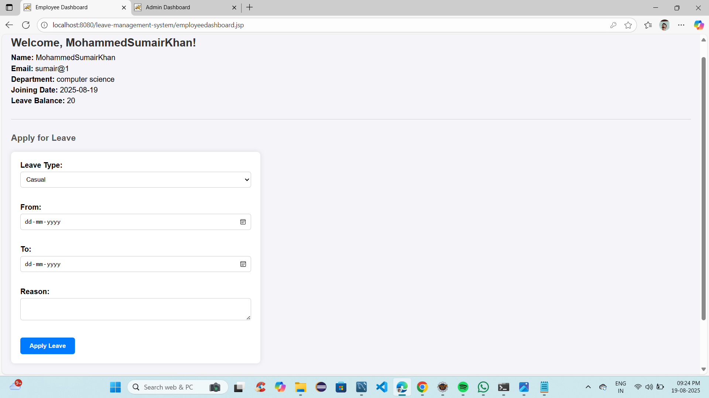
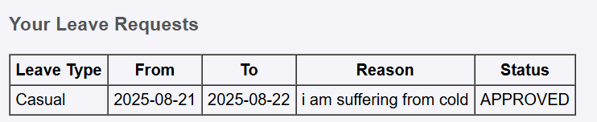

# Leave Management System

## Project Overview
A web-based system to manage employee leaves. Admin(HR) can approve/reject leave requests, view reports, and employees can apply for leaves.

## Setup Steps
1. Install Java JDK and Apache Tomcat.
2. Import the project into Eclipse or your preferred IDE.
3. Setup MySQL database:
   - Run `database.sql` to create tables (`admin`, `employees`, `leave_requests`, `leave_balance`).
4. Configure `DBConnection.java` with your database credentials.
5. Deploy the project to Tomcat and run.

## Assumptions
- Each employee has 20 total leaves per year.
- Only admin can approve or reject leaves.
- Leaves are counted as full days.
- Employees cannot apply for leave before joining date.

## Edge Cases Handled
- Applying leave before joining date.
- Applying leave for more days than available.
- Overlapping leave requests.
- Invalid date ranges (end date before start date).
- Employee not found.

## Potential Improvements
- Adding a search bar in the admin dashboard
- Add email notifications for leave approval/rejection.
- Add leave categories (Sick, Casual, Earned).
- Add leave history for employees. // to be checked 

## API Endpoints (Servlets)

- **/ApplyLeaveServlet** (POST)  
  - **Description:** Employee applies for leave  
  - **Input:** leaveType, fromDate, toDate, reason  
  - **Output:** Success/failure alert

- **/LeaveActionServlet** (GET)  
  - **Description:** Admin(HR) approves/rejects leave  
  - **Input:** id, action  
  - **Output:** Success/failure alert

- **/LeaveReportServlet** (GET)  
  - **Description:** Admin(HR) views leave reports  
  - **Input:** -  
  - **Output:** List of employees with leaves taken/remaining
  
  “Other servlets include employee login, logout, Admin login,view employee, etc., following similar 	input/output 	patterns.”

## HLD Diagram

## Database Setup
1. Create a database in MySQL (example: `leave_management`).
2. Run the SQL script inside `/database/schema.sql` to create the required tables.

## Screenshots

Note i have added most of the important screenshots 

